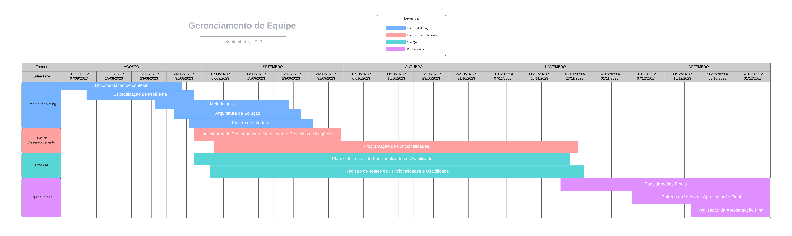

# Especificações do Projeto

Pré-requisitos: <a href="1-Documentação de Contexto.md"> Documentação de Contexto</a>

Definição do problema e ideia de solução a partir da perspectiva do usuário. É composta pela definição do  diagrama de personas, histórias de usuários, requisitos funcionais e não funcionais além das restrições do projeto.

Apresente uma visão geral do que será abordado nesta parte do documento, enumerando as técnicas e/ou ferramentas utilizadas para realizar a especificações do projeto

## Personas
<ul>
<li>Igor Carmenere: Baterista de uma banda de rock, 44 anos, divorciado. Tem disponibilidade para sair tanto nos finais de semana, quanto em dias de semana. Tem interesse em frequentar estabelecimentos que tenham música ao vivo, independentemente do tipo de música. Só não gosta de música sertaneja. </li>
 
<li>Marcia Arruda: 40 anos, proprietária de um bar no centro da cidade, com salário em média de 10mil reais, é formada em marketing e está sempre antenada em novas formas de divulgação. </li>
 
<li>Kelly Cristina: Jovem de 20 anos, solteira, cursando faculdade de Psicologia. Busca por todos os tipos de eventos com música eletrônica, como raves e night clubs. </li>
 
<li>Carlos Eduardo: Empresário, 31 anos. Possui uma empresa que reúne bandas para fazerem shows em restaurantes e bares. Ele está à procura de sistemas que auxiliem na divulgação de seus shows. </li>
 
<li>Nicolly Vignatti tem 24 anos e é formada em administração, trabalha na área de formação ganhando atualmente 2500 reais, nos finais de semana adora curtir um barzinho ou ir em algum show com os amigos. Compartilha um apto com sua melhor amiga e tem 2 gatos.  </li>
 
<li>Joaquim Pedro: tem 31 anos, formado em Agronomia e um entusiasta da música. Trabalha em uma empresa chamada “A de Agro”, tem um lucro mensal variável que fica entre R$3.500,00 a R$4.000,00 e sempre que tem um tempo de sobra, principalmente nos feriados e finais de semana, procura visitar novos bares e restaurantes com música ao-vivo em sua cidade, seja apenas para ouvir boa música, ou para tocar algumas quando possível. </li>
  
<li>Gustavo Henrique: é um jovem de 20 anos completamente apaixonado pelo mundo dos Games desde muito novo. Hoje ele é um estudante na área de Desenvolvimento de Jogos Eletrônicos e que está sempre buscando por eventos relacionados a área, na sua cidade e nas cidades próximas, seja para aprimorar seus conhecimentos no desenvolvimento de games e se atualizar sobre as novidades do mercado, ou mesmo para simplesmente aproveitar os eventos como o grande fã de jogos eletrônicos que ele é. Recentemente ele foi contratado como estagiário pelo canal de TV chamado Esporte Interativo para atuar no programa chamado EI Games que como o nome já diz, é focado em Games.</li>  
 
<li>Mayara Rodrigues: Professora de português de 34 anos, mestranda. Tem seus horários um pouco confusos devido ao mestrado, porém sempre está em busca de eventos culturais mais alternativos. Adora MPB, artes e joga conversa fora.</li> 
 
<li>Ramon Gomes: Engenheiro Eletrotécnico de 28 anos, solteiro e sempre em busca locais movimentados e com gente. Adora baladas e pagodes. Sempre em busca de pessoas solteira para se relacionar.</li> 
 
</ul>

## Histórias de Usuários

Com base na análise das personas foram identificadas as seguintes histórias de usuários:

|EU COMO... `PERSONA`| QUERO/PRECISO ... `FUNCIONALIDADE` |PARA ... `MOTIVO/VALOR`                 |
|--------------------|------------------------------------|----------------------------------------|
| Igor Carmenere | Encontrar bares que tocam música ao vivo| Poder conhecer novos lugares com esse tipo de entretenimento. Saber onde está acontecendo algum evento com música ao vivo |
| Marcia Arruda  | Cadastrar o bar que ela é proprietária em um aplicativo chamativo | Alcançar variados tipos de clientes para aumentar o movimento do seu estabelecimento |
| Kelly Cristina | Saber se terá e onde algum evento de música eletrônica nas próximas semanas| Evitar de ter de fazer diversas buscas no google e em redes sociais para encontrar o que precisa |
| Carlos Eduardo | Conseguir cadastrar eventos do seu estabelecimento no aplicativo, com local, horário e tipo do evento | Conseguir divulgar seus shows com mais facilidade e com isso aumentar seu lucro |
| Nicolly Vignatti | Manter-me antenada aos eventos da minha cidade e de outras que eu eventualmente for visitar | Aproveitar a vida noturna nos melhores eventos |
| Joaquim Pedro | Buscar novos locais, sejam bares ou restaurantes que tenham um espaço alocado para eventos musicais | Encontrar novos locais para conhecer novas pessoas e aproveitar boa música/entretenimento |
| Gustavo Henrique | Encontrar novos eventos, reuniões e festas voltadas à área dos Games | Para estudo, para aumentar sua rede de contatos ou apenas para entretenimento |
| Mayara Rodrigues | Saber com facilidade onde estão os eventos culturais mais próximos de mim, com antecedência ou no mesmo dia | Planejar um dia legal sem muito esforço e possuindo informações suficientes para não me frustrar |
| Ramon Gomes | Encontrar bares, eventos fechados ou abertos nas minha região, preferencialmente com avaliações, podendo buscar por datas ou estilos de ambiente | Divertir-me sem que tenha o transtorno de procurar em redes sociais, perguntar a amigos a satisfação. Ou seja, ter uma noite agradável com menor esforço e chance de arrependimento |  

Apresente aqui as histórias de usuário que são relevantes para o projeto de sua solução. As Histórias de Usuário consistem em uma ferramenta poderosa para a compreensão e elicitação dos requisitos funcionais e não funcionais da sua aplicação. Se possível, agrupe as histórias de usuário por contexto, para facilitar consultas recorrentes à essa parte do documento.

> **Links Úteis**:
> - [Histórias de usuários com exemplos e template](https://www.atlassian.com/br/agile/project-management/user-stories)
> - [Como escrever boas histórias de usuário (User Stories)](https://medium.com/vertice/como-escrever-boas-users-stories-hist%C3%B3rias-de-usu%C3%A1rios-b29c75043fac)
> - [User Stories: requisitos que humanos entendem](https://www.luiztools.com.br/post/user-stories-descricao-de-requisitos-que-humanos-entendem/)
> - [Histórias de Usuários: mais exemplos](https://www.reqview.com/doc/user-stories-example.html)
> - [9 Common User Story Mistakes](https://airfocus.com/blog/user-story-mistakes/)

## Modelagem do Processo de Negócio 

### Análise da Situação Atual

Devido à falta de plataformas que divulgam de forma clara e atualizada as agendas, endereços, redes sociais ou mesmo sites de locais que ofereçam algum tipo de entretenimento, surgiu a necessidade da criação do aplicativo-EntreTime  para ajudar aqueles que procuram por diversão sem ter que perder muito tempo em buscas no Google, Redes Sociais ou algum outro meio.

### Descrição Geral da Proposta

A proposta do  aplicativo-EntreTime  é oferecer uma plataforma onde seja possível encontrar, de forma clara e de fácil manuseio, informações relevantes de locais com algum tipo de entretenimento. Será possível, por meio da plataforma, filtrar tipos, locais e datas para a busca por diversão. Com o EntreTime,  Entre(tenimento) é no tempo(Time) que a pessoa tenha, e é facil encontrar.

### Processo 1 – NOME DO PROCESSO

### Processo 2 – NOME DO PROCESSO

## Indicadores de Desempenho

Apresente aqui os principais indicadores de desempenho e algumas metas para o processo. Atenção: as informações necessárias para gerar os indicadores devem estar contempladas no diagrama de classe. Colocar no mínimo 5 indicadores. 

|Indicador   | Objetivo | Descrição | Cálculo | Fonte de Dados | Perspectiva |
|------------|----------|-----------|---------|----------------|-------------|
| Taxa de Cadastros de Usuários | Aumentar o número de cadastros de usuários no sistema | Mede a eficiência do processo de cadastro de usuários | (Número de novos cadastros / Total de usuários) * 100% | Classe Usuário, metódo Cadastrar | Gestão do sistema |
| Taxa de Sucesso de Login | Garantir uma alta taxa de sucesso nos logins dos usuários | Mede a eficácia do processo de login no sistema | (Número de logins bem-sucedidos / Número total de tentativas de login) * 100% | Classe Usuário, metódo Login | Segurança do sistema |
| Taxa de Eventos Criados por Empresários | Aumentar a criação de eventos pelos empresários | Mede a participação dos empresários na criação de eventos | (Número de eventos criados por empresários / Número total de eventos) * 100% | Classes Evento e Empresário | Engajamento dos empresários |
| Taxa de Eventos Salvos por Consumidores | Aumentar o número de eventos salvos pelos consumidores | Mede a interação dos consumidores com os eventos | (Número de eventos salvos por consumidores / Número total de eventos) * 100% | Classes Evento e Consumidores | Engajamento dos consumidores |
| Taxa de Eventos Pesquisados por Consumidores | Aumentar a pesquisa ativa de eventos pelos consumidores | Mede a busca ativa dos consumidores por eventos | (Número de pesquisas de eventos por consumidores / Número total de consumidores) * 100% | Classes Evento e Consumidor | Engajamento dos consumidores|

Usar o seguinte modelo: 

Obs.: todas as informações para gerar os indicadores devem estar no diagrama de classe a ser apresentado a posteriori. 

## Requisitos

A equipe utilizou, para classificar os Requisitos, a técnica de Escala de Três Níveis, bem como o quadrante de priorização de acordo com questões de importância e urgência.

### Requisitos Funcionais

|ID    | Descrição do Requisito  | Prioridade |
|------|-----------------------------------------|----|
|RF-001| A aplicação deve ter uma tela inicial onde será possível pesquisar os eventos e estabelecimentos que ofereçam algum tipo de entretenimento. | ALTA | 
|RF-002| A aplicação deve ter páginas com eventos similares agrupados. | MÉDIA |
|RF-003| A aplicação deve permitir verificar a agenda de um local específico. | MÉDIA | 
|RF-004| A aplicação deve dar para visualizar eventos em uma cidade distante da minha. | MÉDIA |
|RF-005| A aplicação deve permitir o usuário filtrar a distância em quilometragem que ele esteja disposto a ir para um evento. | MÉDIA | 
|RF-006| A aplicação deve visualizar os barzinhos mais populares da cidade. | BAIXA |
|RF-007| A aplicação deve permitir que o usuário avalie os locais e eventos que ele frequentou recentemente. | BAIXA | 
|RF-008| A aplicação deve possibilitar o autogerenciamento de usuários. | ALTA |
|RF-009| A aplicação deve ter uma sessão de Suporte/Dúvidas. | BAIXA | 
|RF-010| A aplicação deve oferecer para o planejador do evento campos obrigatórios sobre informações do evento, como nome, local, horário de início e fim, tipo de ambiente, estilo de evento, programação e regras do espaço onde o evento será realizado. | MÉDIA |
|RF-011| A aplicação deve ser capaz de deixar o usuário visualizar eventos com base em sua geolocalização. | MÉDIA | 
|RF-012| A aplicação deve permitir a consulta por períodos. | MÉDIA |

### Requisitos não Funcionais

|ID     | Descrição do Requisito  |Prioridade |
|-------|-------------------------|----|
| RNF-001 | A aplicação deve ser intuitiva e fácil de aprender para os usuários.  | ALTA | 
| RNF-002 | A aplicação deve se adaptar a diferentes tamanhos de tela e orientações  |  ALTA |
| RNF-003 | A aplicação deve funcionar no sistema Android  |  ALTA | 
| RNF-004 | A aplicação deve exibir apenas eventos que restem no mínimo 3h para o final planejado  |  MÉDIA | 
| RNF-005 | A aplicação deve estar disponível e funcionando corretamente durante a maior parte do tempo, com tempo de inatividade mínimo ou nulo.  | ALTA | 
| RNF-006 | A aplicação deve ter tempo se resposta menor que 2 segundo a cada requisição realizada.  |  MÉDIA | 

## Restrições

O projeto está restrito pelos itens apresentados na tabela a seguir.

|ID| Restrição                                             |
|--|-------------------------------------------------------|
|01| O projeto deverá ser entregue até o final do semestre |
|02| Não pode ser desenvolvido um módulo de backend        |

Enumere as restrições à sua solução. Lembre-se de que as restrições geralmente limitam a solução candidata.

> **Links Úteis**:
> - [O que são Requisitos Funcionais e Requisitos Não Funcionais?](https://codificar.com.br/requisitos-funcionais-nao-funcionais/)
> - [O que são requisitos funcionais e requisitos não funcionais?](https://analisederequisitos.com.br/requisitos-funcionais-e-requisitos-nao-funcionais-o-que-sao/)

## Diagrama de Casos de Uso

O diagrama de casos de uso é o próximo passo após a elicitação de requisitos, que utiliza um modelo gráfico e uma tabela com as descrições sucintas dos casos de uso e dos atores. Ele contempla a fronteira do sistema e o detalhamento dos requisitos funcionais com a indicação dos atores, casos de uso e seus relacionamentos.

As referências abaixo irão auxiliá-lo na geração do artefato “Diagrama de Casos de Uso”.

> **Links Úteis**:
> - [Criando Casos de Uso](https://www.ibm.com/docs/pt-br/elm/6.0?topic=requirements-creating-use-cases)
> - [Como Criar Diagrama de Caso de Uso: Tutorial Passo a Passo](https://gitmind.com/pt/fazer-diagrama-de-caso-uso.html/)
> - [Lucidchart](https://www.lucidchart.com/)
> - [Astah](https://astah.net/)
> - [Diagrams](https://app.diagrams.net/)

# Matriz de Rastreabilidade

A matriz de rastreabilidade é uma ferramenta usada para facilitar a visualização dos relacionamento entre requisitos e outros artefatos ou objetos, permitindo a rastreabilidade entre os requisitos e os objetivos de negócio. 

 

> **Links Úteis**:
> - [Artigo Engenharia de Software 13 - Rastreabilidade](https://www.devmedia.com.br/artigo-engenharia-de-software-13-rastreabilidade/12822/)
> - [Verificação da rastreabilidade de requisitos usando a integração do IBM Rational RequisitePro e do IBM ClearQuest Test Manager](https://developer.ibm.com/br/tutorials/requirementstraceabilityverificationusingrrpandcctm/)
> - [IBM Engineering Lifecycle Optimization – Publishing](https://www.ibm.com/br-pt/products/engineering-lifecycle-optimization/publishing/)

# Gerenciamento de Projeto

De acordo com o PMBoK v6 as dez áreas que constituem os pilares para gerenciar projetos, e que caracterizam a multidisciplinaridade envolvida, são: Integração, Escopo, Cronograma (Tempo), Custos, Qualidade, Recursos, Comunicações, Riscos, Aquisições, Partes Interessadas. Para desenvolver projetos um profissional deve se preocupar em gerenciar todas essas dez áreas. Elas se complementam e se relacionam, de tal forma que não se deve apenas examinar uma área de forma estanque. É preciso considerar, por exemplo, que as áreas de Escopo, Cronograma e Custos estão muito relacionadas. Assim, se eu amplio o escopo de um projeto eu posso afetar seu cronograma e seus custos.

## Gerenciamento de Tempo

<h4>Diagrama de Rede Simplificado Inicial (Gestão de Tempo e Tarefas)</h4>

<h4>Diagrama de Gantt Inicial (Gestão de Tempo e Tarefas)</h4>

## Gerenciamento de Equipe

O gerenciamento adequado de tarefas contribuirá para que o projeto alcance altos níveis de produtividade. Por isso, é fundamental que ocorra a gestão de tarefas e de pessoas, de modo que os times envolvidos no projeto possam ser facilmente gerenciados. 

## Gestão de Orçamento

O processo de determinar o orçamento do projeto é uma tarefa que depende, além dos produtos (saídas) dos processos anteriores do gerenciamento de custos, também de produtos oferecidos por outros processos de gerenciamento, como o escopo e o tempo.

Obs! Mesmo sabendo que alguns funções serão pessoas repetidas, tratamos como se estivessemos contratando pessoas diferentes, já que no mundo real as funções são desempenhadas por pessoas diferentes.

